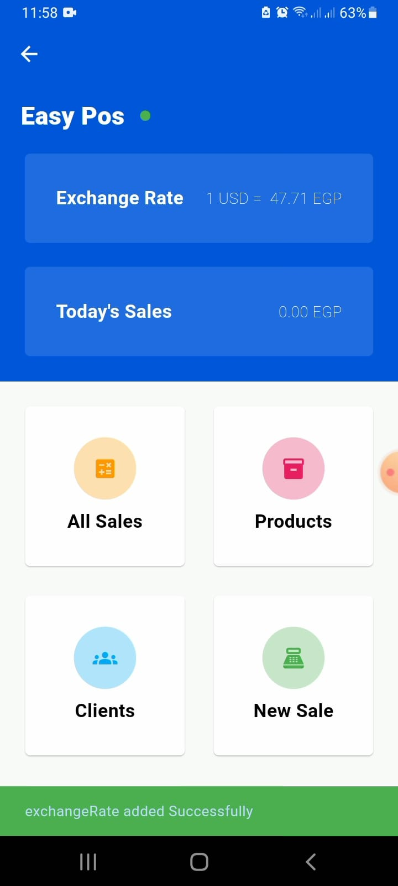
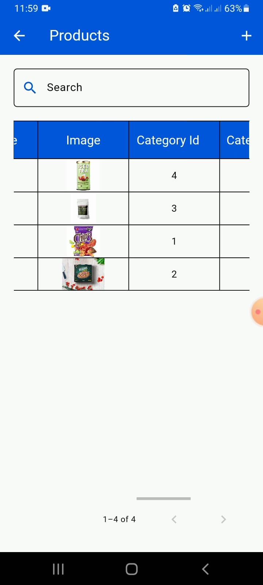
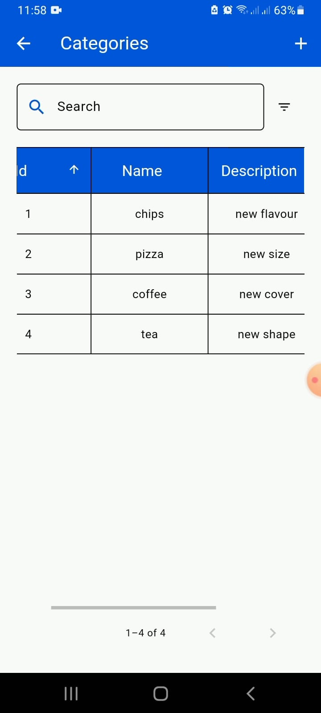
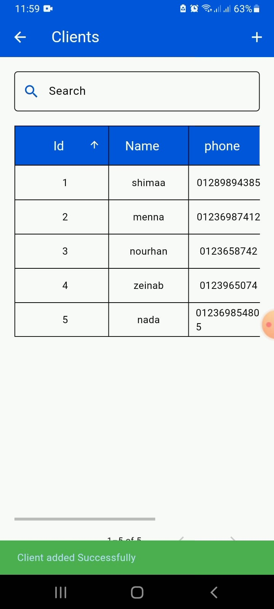
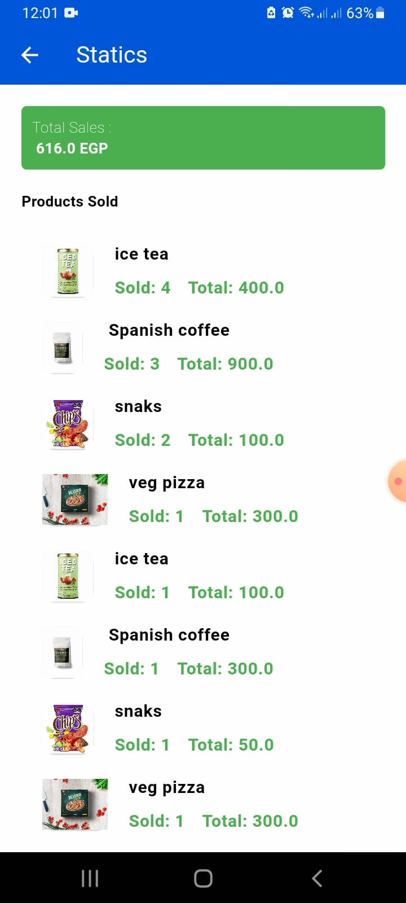

# Easy POS

A Flutter-based Point of Sale (POS) application designed to manage products, categories, clients, and sales through a simple and user-friendly interface.

## Features

- Product Management
- Category Management


- Client Management
- Sales Management
- Sales Statistics
- Local SQLite Database
- Responsive UI
- Onboarding Screen

## Tech Stack

- Flutter
- Dart
- SQLite
- GetIt
- DataTable2
- Intl
- Animate_Do

## Project Structure

```
lib
├── helpers
├── models
├── views
├── widgets
└── main.dart
```

## Screenshots

| Splash | Home |
|--------|------|
|  |  |

| Products | Categories |
|----------|------------|
|  |  |

| Clients | Statics |
|---------|------------|
|  |  |

## Demo
Watch the demo here:
https://youtube.com/shorts/Y51alEYx7Xw?feature=share


## Getting Started

```bash
flutter pub get
flutter run
```

## What I Learned
- Working with SQLite local database.
- Building CRUD operations.
- Managing product and sales data.
